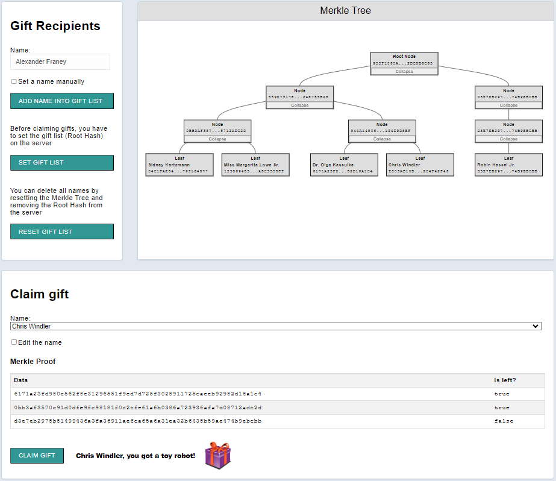

# Gift List

This project serves as a simple demonstration of how Merkle trees function within a blockchain context.

### Setup

To get started with the repository, clone it and then run `npm install` in both `client` and `server` directories to install the depedencies.

There are three main folders in this repository:

#### Client

The `client` directory contains a [react app](https://reactjs.org/) using [vite](https://vitejs.dev/). You can run the client with `npm run dev` command.

Think of the client as the _prover_ here. It needs to prove to the server that some `name` is in the current `merkleRoot` on the server. 

#### Server

The server folder contains a node.js server using [express](https://expressjs.com/). To run the server, execute the command: `node index`.

The application should connect to the default server port (3042) automatically and respond to the client's requests.

Think of the server as the _verifier_ here. It needs to verify that the `name` passed by the client is in the current `merkleRoot`. If it is, then we can send the gift!

_Hint_ - Use [nodemon](https://www.npmjs.com/package/nodemon) instead of `node` to automatically restart the server on any changes.

#### Utils

There are a few files in utils:

- The `niceList.json` which contains all the names of the people who deserve a gift this year (this is randomly generated, feel free to add yourself and others to this list!)
- The `example.mjs` script shows how we can generate a root, generate a proof and verify that some value is in the root using the proof. Try it out with `node example.js`
- The `MerkleTree.mjs` contains a class that helps with Merkle root and Merkle proof calcucations. It is imported in the client.
- The `verifyProof.mjs` is used to prove that a name is in the merkle root.

### Use

The **Gift Recipients** container allows user to add random names (or manually specified ones) to the Merkle tree. This process mirrors the aggregation of transactions from a pool to form a block within a blockchain system. Once all desired names have been added to the tree, the root hash must be transmitted to the server for storage. This mirrors the addition of a block on the blockchain. After the root hash has been send and stored to the server, no additional names can be added to the tree.

The **Merkle Tree** container displays the current state of the tree along with hash details for any selected node. The tree is updated dynamically while user adds new names in the gift list.

The **Claim gift** container allows user to claim a gift for a name that has already been added to the tree. For any selected name, the Merkle proof is displayed along with the option to modify the name of the current leaf node.

Clicking on the 'Claim gift' button, reveals whether the selected name is eligible to receive a gift. The Merkle proof is sent to the server, where the root hash is calculated based on this proof and compared to the stored root hash. Any modified name results in a mismatch between the calculated and stored root hash, and consequently, the gift should not be issued.

The project is based on the Alchemy univeristy week 2 project template: https://github.com/alchemyplatform/GiftList